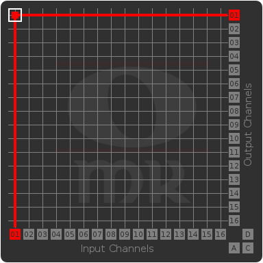
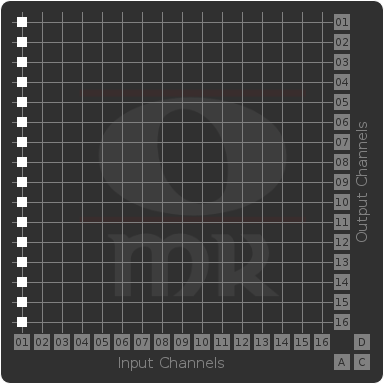
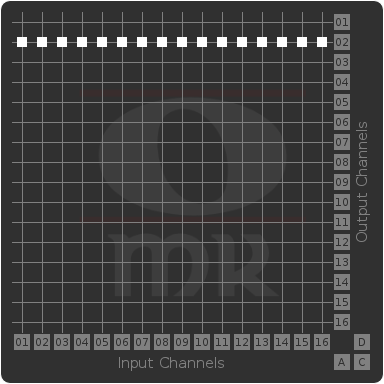
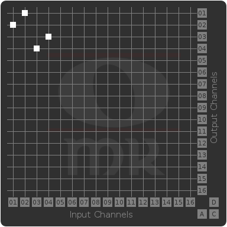
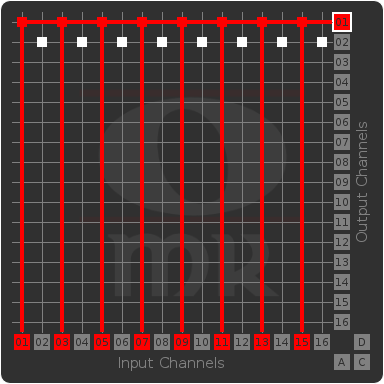
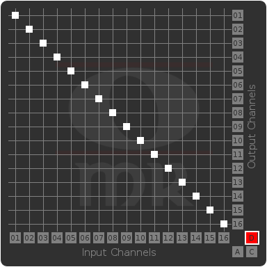
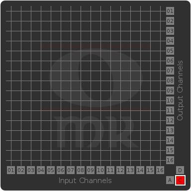
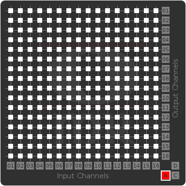

# Midi Matrix

## A LV2 Plugin Bundle

### Build status

### Plugins

#### Channel Filter

The Midi Matrix - Channel Filter is a 3-in-1 filter plugin with a simple UI enabling you to easily accomplish:
- MIDI channel filtering (e.g. blocking of specific channels)
- MIDI channel multiplication (e.g. send events from channel X to channels X, Y and Z)
- MIDI channel rerouting (e.g send events from channel X to channel Y)
- And any possible combination thereof

##### Example Configurations

_Through: Connection 03-03 highlighted_

_Block: All channels blocked but channel 01_

_Multiplication: Send channel 01 events to all channels_

_Multiplex: Aggregate events from all channels to channel 02_

_Reroute: Switch events of port 01/02 and 03/04, respectively_

_Reroute/Multiplex: Aggregate events from odd ports to channel 01 and events from even ports to channel 02_

_Default: The default configuration is a Midi-Through_

_Clear: All channels are blocked_

_All: Route everything to everyghing_

### Dependencies

* [LV2](http://lv2plug.in) (LV2 Plugin Standard)
* [EFL](http://enlightenment.org) (Enlightenment Foundation Libraries)

### Build / install

	git clone https://github.com/OpenMusicKontrollers/midi_matrix.lv2.git
	cd midi_matrix.lv2
	mkdir build
	cd build
	cmake -DCMAKE_C_FLAGS="-std=gnu99" ..
	make
	sudo make install
